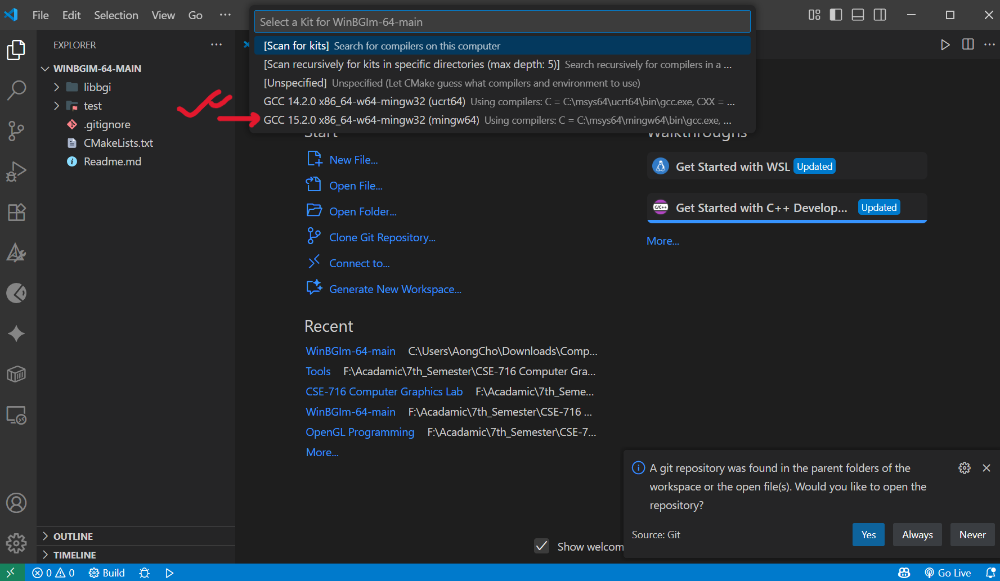
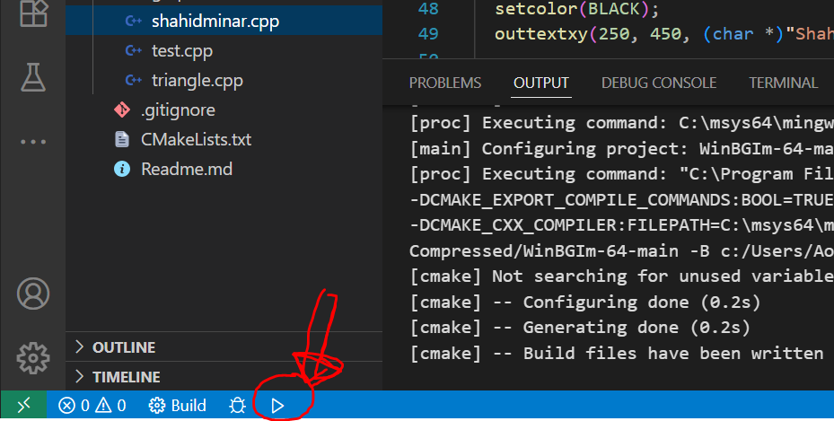

# Graphics Setup Guide in Visual Studio Code (64-bit)

This guide provides step-by-step instructions to set up the **WinBGIm graphics library** in Visual Studio Code (VS Code) on a 64-bit Windows system using **GCC** and **CMake**.

---

## Prerequisites

Before starting, ensure the following software is installed:

1. **Visual Studio Code**
   Download: [https://code.visualstudio.com/](https://code.visualstudio.com/)

2. **GCC Compiler**
   Install via **MinGW-w64** or **MSYS2**:

    - **MinGW-w64:** [https://sourceforge.net/projects/mingw-w64/](https://sourceforge.net/projects/mingw-w64/)
    - **MSYS2:** [https://www.msys2.org/](https://www.msys2.org/)
      After installing MSYS2, run in terminal:

        ```bash
        pacman -S mingw-w64-x86_64-gcc
        ```

3. **CMake**
   Download: [https://cmake.org/download/](https://cmake.org/download/)

4. **Git**
   Download: [https://git-scm.com/downloads](https://git-scm.com/downloads)

---

## Step 1: Verify GCC and CMake Installation

1. Open **Command Prompt**, **PowerShell**, or **MSYS2 terminal**.
2. Check installations:

    ```bash
    gcc --version
    cmake --version
    ```

3. If commands fail, ensure the paths are added to your system environment variables:

    - MinGW-w64: `C:\MinGW\bin`
    - MSYS2: `C:\msys64\mingw64\bin`
    - CMake: `C:\Program Files\CMake\bin`

---

## Step 2: Clone the WinBGIm Repository

1. Open a terminal.
2. Clone the repository:

    ```bash
    git clone https://github.com/AongCho880/Computer-Graphics.git
    ```

---

## Step 3: Set Up the Project in VS Code

1. Open VS Code → `File > Open Folder` → select the `WinBGIm-64-main` directory.
2. Install recommended extensions:

    - **C/C++** (by Microsoft)
    - **CMake Tools** (by Microsoft)

3. Select the appropriate C compiler when prompted (e.g., GCC from MinGW-w64 or MSYS2).
   
5. Wait for **CMake** to configure the project (creates a `build` directory).
6. Open `test/test.cpp`.
7. Run the code using the **Run** button in VS Code — a graphics window should appear.
   

---

## Step 4: Creating a New Graphics Program

1. In the `test` directory, create `your_file_name.cpp`.
2. Add your graphics code:

    ```cpp
    #include "graphics.h" // Make sure graphics.h is in double
    #include <conio.h>

    int main() {
      // Initialize graphics mode
      int gd = DETECT, gm;
      char driverPath[] = "";
      initgraph(&gd, &gm, driverPath);

      // Set color
      setcolor(WHITE);

      // Draw a triangle using 3 lines
      line(200, 100, 300, 300); // side 1
      line(300, 300, 100, 300); // side 2
      line(100, 300, 200, 100); // side 3

      // Fill the triangle (optional)
      setfillstyle(SOLID_FILL, GREEN);
      floodfill(200, 200, WHITE);

      // Wait for a key press
      getch();

      // Close graphics window
      closegraph();
      return 0;
    }

    ```

3. Update `test/CMakeLists.txt` to include your new file:

    ```cmake
    add_executable(testbgi your_file_name.cpp graphics.h)
    target_link_libraries(testbgi bgi)
    ```

4. Save the file — CMake will reconfigure automatically.
5. Build and run `your_code.cpp` using VS Code.
   

---

## Troubleshooting

-   **Compiler Not Found:** Ensure GCC is installed and added to `PATH`.
-   **CMake Errors:** Verify CMake installation and `CMakeLists.txt` syntax.
-   **Graphics Window Not Displaying:** Confirm `graphics.h` is correctly linked and the executable exists in `build`.

---
