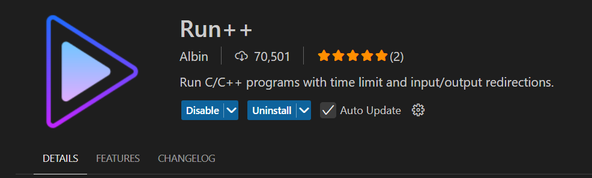
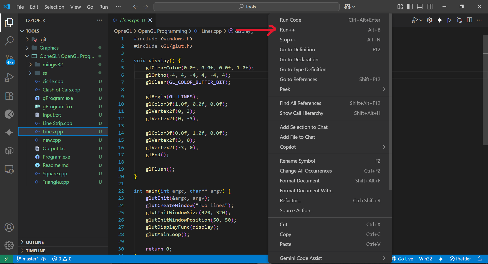

## Steps to run OpenGL Program

---

-   Browse to `\OpneGL\OpenGL Programming` and open with vs code
-   Install Run++ extension 
-   Open the `Lines.cpp` file and run the code with Run++ extension 
